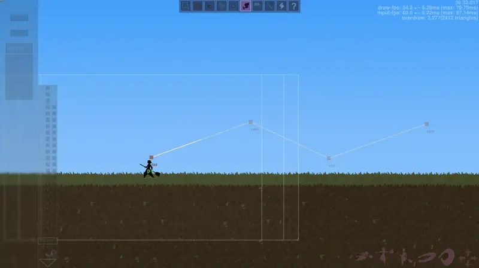
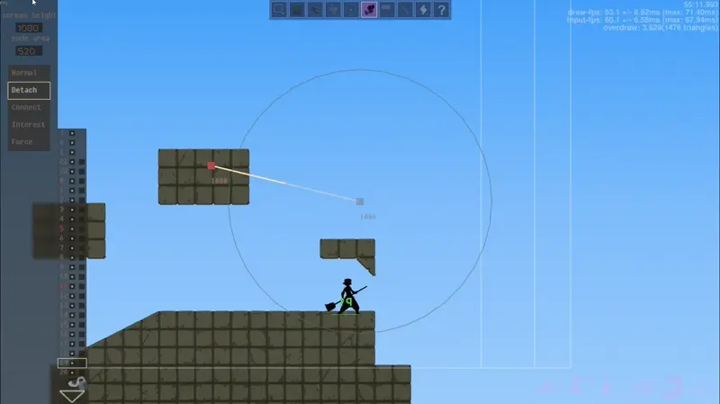
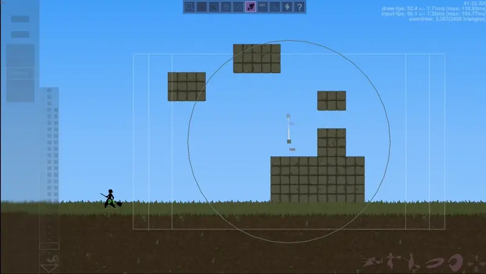
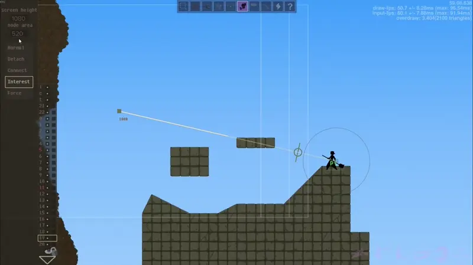
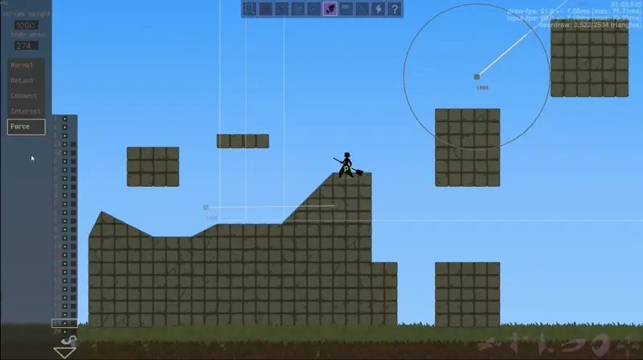
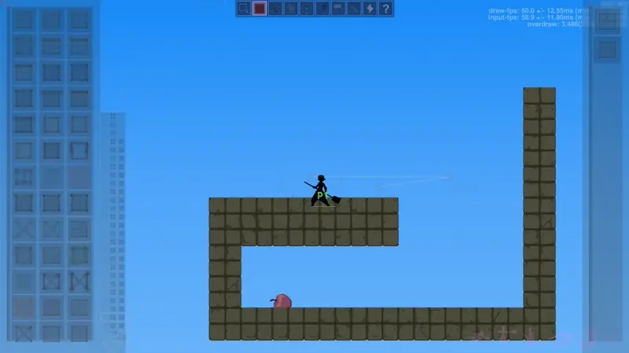
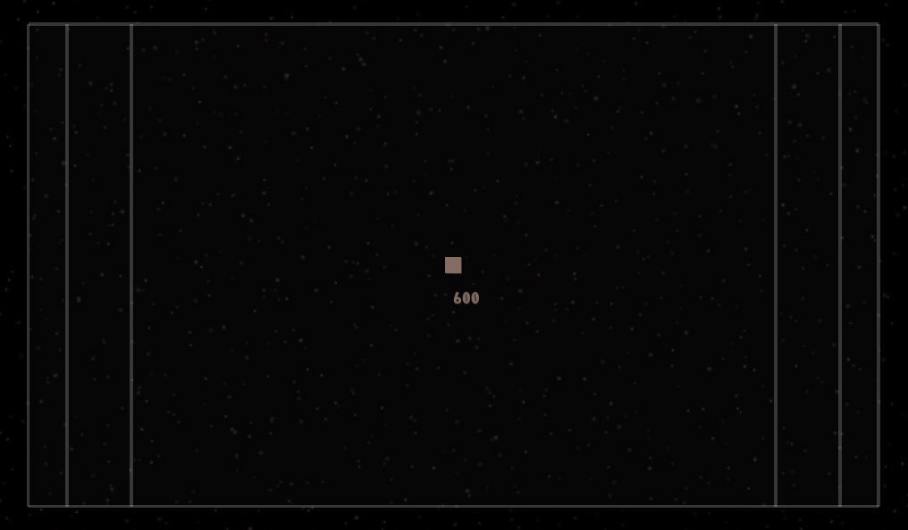
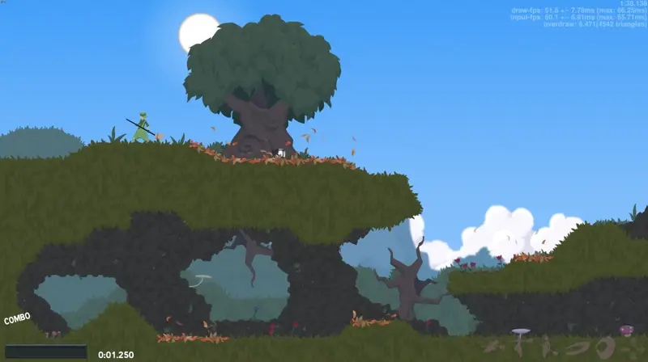
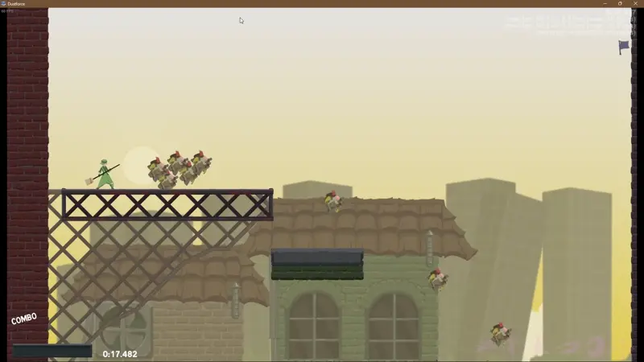

# Camera Guide #

## Table of Contents ##
Todo
 

## Camera Basics ##
The Camera menu is where you can control how the camera functions during gameplay in Dustforce. To get started first click on the Camera menu then left click somewhere in your level. This is called a "camera node" to interact with the camera node, click on it while you have the camera menu selected. You can delete camera nodes by using right click. 

For an in-game guide to learn about cameras, check out: [Camera Tutorial Z by Shin](http://atlas.dustforce.com/8441/camera-tutorial-z)

*Note: Cameras in Dustforce aren't very "strict" and behave in a very loose manner. This can be seen as when moving the camera will be slightly ahead of the player and then move back to center when the player is stopped. However, this can cause some situations where the camera doesn't work exactly as what may be viewed on screen, but has the benefit of allowing cameras to work in a lot of different situations.* 

#### <u>Screen Height & Node Area</u> ####
When a camera node is selected, you can adjust the screen height (and by extension screen width) by adjusting the number in the `screen height` box. It's recommended to not go below 950, to allow the player to see where they are going, or above 2500 to keep lag to a minimum.

You can also adjust the node size in the `node area` box. This node area only applies to the camera types `connect` and `force`.

#### <u>Camera Node Types</u>####
Camera nodes can have different types that change the behaviors of the camera. These are independent of each other and a full camera path can have multiple different camera types on it.  By default camera types are `normal` type. To interact with any of the features of the camera node, make sure you select the camera node first.
##### Normal Node #####
Normal camera nodes are the default camera node. Normal camera nodes are mainly used to help dictate the camera path for the player, they help to center the camera's focus on certain gameplay areas. They don't behave in any special way based on the player position (other than [[#<u>Camera Breaks</u>|Camera Breaks]]).  When moving in-between normal camera nodes, the camera will show slightly ahead of the player and will move back to center when the player stops. 

##### Detach Node #####
Detach camera nodes will detach the player from their connected camera path. This only happens when the player reaches the camera node itself, not just it's area of influence. These are mainly used in junction with force nodes when the camera is too complicated in an area or for when you want to allow the player to leave the typical bounds of your level to find secrets such as apples.

*Note: You can not reconnect to the camera path unless a connect node is present or you get close to a camera node*

##### Connect Node #####
Connect  camera nodes act very similarly to a normal node. When the player is not connected to a camera path and they enter the `node area` they will be immediately connected to that camera node. If the player is already connected to a path the Connect node will behave as a normal camera node. Connect nodes are typically used at the start of the level to instantly connect the player to your desired camera paths, or after using a detach node.

##### Interest Node #####
Interest camera nodes are the most useful, and the most complicated when it comes to their uses. When you have an interest node selected two green circles will appear along the camera path. These circles indicate that when the player position on the camera path passes this circle then the camera will be pulled towards the camera node. What this means is once the player enters the influence of the interest node, you can create "locked cameras" due to the camera not moving until until the player position on the camera path leaves the influence of the interest node.  Interest nodes are mainly used to show the player what is coming ahead of them during falls, or fast sections where knowing what is coming up is advantageous to the player.

##### Force Node #####
Force camera nodes force the player onto a specific camera path (or node) regardless of any other circumstance. When the player enters the `node area` the camera will move to that camera node. Force nodes are mainly used for creating alternate routes (such as any%) routes, or helping deal with tricky camera situations. 

#### <u>Camera Paths</u> ####
A camera node can be connected any number of other camera paths. However, most levels will typically follow a single path system though splitting paths can be helpful for creating any% routes or other specific layouts.

It's important to consider the angle of camera paths. Camera paths don't behave as expected when dealing with sharp angles. They want the player to be at the closest camera node, so will move forwards or backwards along the path to make sure this holds true

*Note: The player position on the camera path is slightly different then what is visible in the editor. While this doesn't come into play often and often makes for a smooth camera experience, it is something to keep in mind. Read more about it in the [Advance Camera](Advance%20Camera.md)*

## Special Camera Rules ##
General introduction

#### <u>Lenience & One Way Paths</u>####
Text here

#### <u>Camera Aspect Ratios</u> ####
When placing a camera, you will notice three different size rectangles. For all intents and purpose, only worry about the largest bounding box.

These different size rectangles have to do with the aspect ratio of the game, and almost never come into play as most monitors are 16:9.

Aspect Ratios:
- Smallest - 4:3
- Middle - 16:10
- Largest - 16:9 
#### <u>No Camera</u> ####
The default camera or "No Camera" is a state where the player is <u>not</u> connected to any camera path. If you never place a camera in your level this is the state your player will be in. The default camera height is 1080.
#### <u>Camera Breaks</u> ####
If the player leaves camera radius, even if the camera is on a path, the camera "breaks" and will return to the No Camera state. Cameras can also be broken by resizing the window while standing far enough way from any single camera node.

**Camera break by leaving the boundary**

**Camera break by resizing the window**

